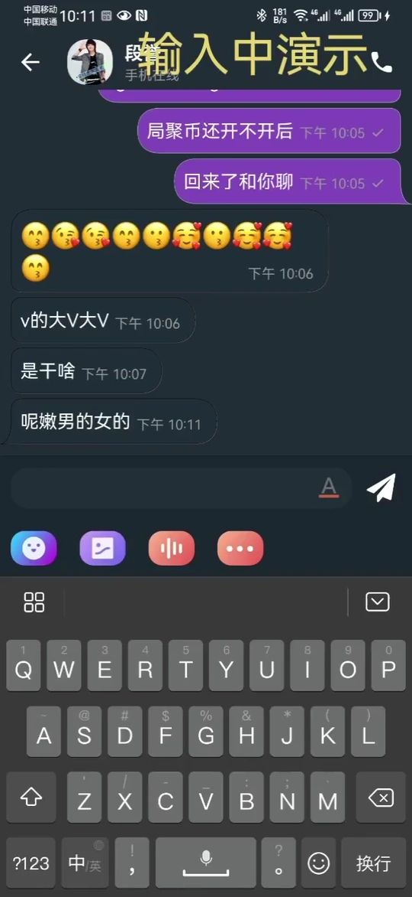
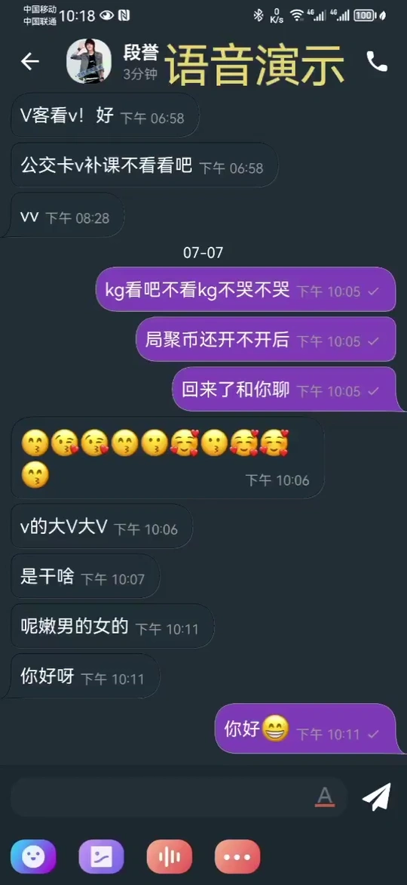
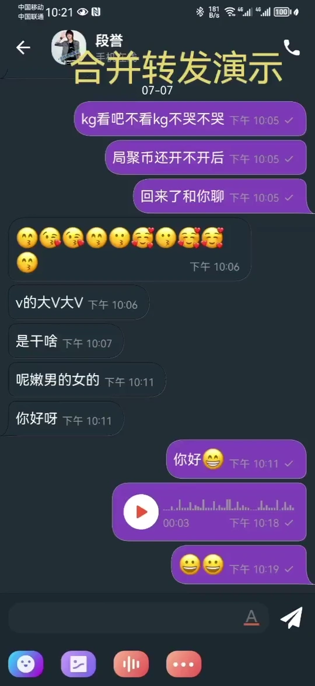
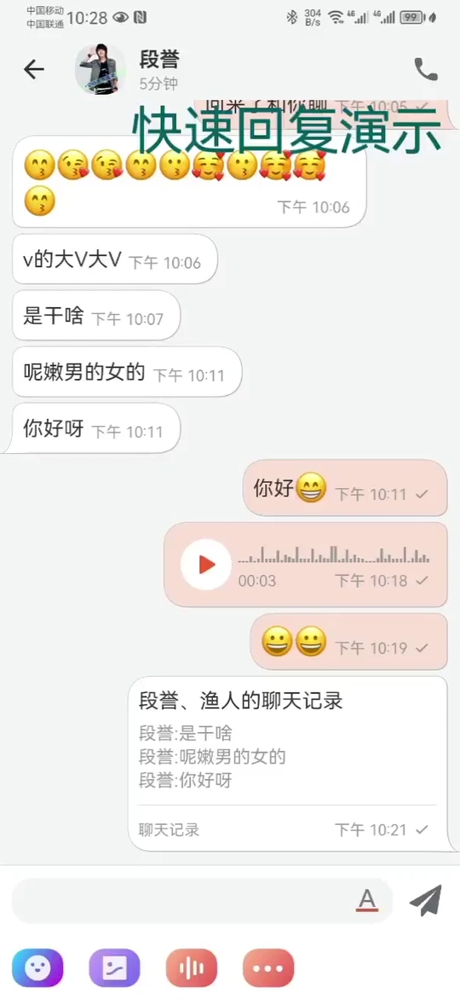

# 唐僧叨叨（[官网](https://tangsengdaodao.com/ "官网")）

    

### **唐僧叨叨 悟空IM提供动力** （[悟空IM](https://githubim.com/ "文档")）

唐僧叨叨基于底层通讯框架`悟空IM`实现聊天功能。Demo已实现`文本`，`图片`，`语音`，`名片`，`emoji`，群聊`@某人`，消息`链接`，`手机号`，`邮箱`识别等功能。聊天设置支持`名称修改`，`头像修改`，`公告编辑`，`消息免打扰`，`置顶`，`保存到通讯录`，`聊天内昵称`，`群内成员昵称显示`等丰富的设置功能。由于demo是模块化开发，开发者可完全按自己的开发习惯进行二次开发。

### 唐僧叨叨特点

- #### **永久保存消息** 卸载唐僧叨叨后下次安装登录后，可查看以前的聊天记录
- #### **超大群** 唐僧叨叨群聊人数无限制，万人群进入聊天完全不卡，消息正常收发
- #### **实时性** 所有操作实时同步，app已读消息，web/pc可实时更改状态
- #### **扩展性强** 唐僧叨叨现已框架可轻松支持消息的已读未读回执，消息点赞，消息回复功能
- #### **开源** 唐僧叨叨100%开源，商业开发无需授权可直接使用

### 项目模块
唐僧叨叨是模块化开发，不限制开发者编码习惯。以下是对各个模块的说明

**`wkbase`**

基础模块 里面包含了`WKBaseApplication`文件，该文件主要是对一些通用工具做些初始化功能，如：网络库初始化，本地db文件初始化等。`WKChatBaseProvider`聊天中重要的基础消息item提供者，所有消息item均继承于此类，里面处理消息气泡样式，头像显示样式，消息间距等很多统一且重要的功能。更多功能请查看源码

**`wkuikit`**

聊天模块 包含了聊天页面`ChatActivity`，该文件处理了聊天信息的展示，离线获取，刷新消息状态等聊天中遇到的各个场景。`ChatFragment` 最近会话列表，新消息红点，聊天最后一条消息展示等。此模块还包括app首页信息，联系人信息，我的页面等

**`wklogin`**

登录模块 包含登陆注册，第三方授权登录，修改账号密码，授权pc/web登录等功能，实现其他方式登录可在此模块进行二次开发

**`wkpush`**

推送模块  唐僧叨叨集成了`华为`,`小米`,`vivo`,`oppo`厂商推送功能。开发者二次开发是只需要替换对应的appID和appKey即可
- **华为** 在官方申请开发者账号并开通推送服务后，下载`agconnect-services.json`文件覆盖`app`模块下的该文件。并在`wkpush`模块的 `AndroidManifest.xml` 文件中的名为`com.huawei.hms.client.appid`的`meta-data`替换appID，`PushKeys`文件中替换`huaweiAPPID`即可

- **小米** 修改此模块下的`PushKeys`文件中的`xiaoMiAppID` 和 `xiaoMiAppKey`即可

- **OPPO** 修改此模块下的`PushKeys`文件中的`oppoAppKey` 和 `oppoAppSecret`即可

- **VIVO** 修改此模块`AndroidManifest.xml` 文件中的名为`com.vivo.push.api_key`的`meta-data`的value 和修改名为`com.vivo.push.app_id`的`meta-data`的value即可

由于开发有限，如需其他厂商的推送功能，只需在此模块按官方文档集成即可

 **`wkscan`**

扫一扫模块 包含扫描二维码进行加好友，加入群聊等

### 自定义消息Item

**注意这里只是介绍如何将自定义的消息item展示在消息列表中，消息model的实现需要去查看[悟空IM](https://github.com/WuKongIM/WuKongIM "文档")文档**

唐僧叨叨实现自定义消息Item也十分简单。只需要实现两步即可

1、 编写消息item provider。继承`WKChatBaseProvider`文件，重写`getChatViewItem`方法如下
```kotlin
override fun getChatViewItem(parentView: ViewGroup, from: WKChatIteMsgFromType): View? {
        return LayoutInflater.from(context).inflate(R.layout.chat_item_card, parentView, false)
    }
```
 > 布局中不需要考虑头像，名称字段

 重写`setData`方法 获取控件并将控件填充数据。如下
 ```kotlin
override fun setData(
    adapterPosition: Int,
    parentView: View,
    uiChatMsgItemEntity: WKUIChatMsgItemEntity,
    from: WKChatIteMsgFromType
) {
    val cardNameTv = parentView.findViewById<TextView>(R.id.userNameTv)
    val cardContent = uiChatMsgItemEntity.wkMsg.baseContentMsgModel as WKCardContent
    cardNameTv.text = cardContent.name
    // todo ...
}
 ```
> 这里的`WKCardContent`消息对象是基于`悟空IM`sdk的实现，所有自定义消息model必须基于`悟空IM`。关于`悟空IM`自定义消息可查看[Android文档](https://githubim.com/sdk/android.html "文档")中的自定义消息

 设置item的消息类型
 ```kotlin
override val itemViewType: Int
    get() = WKContentType.WK_CARD
 ```
2、完成消息item提供者的编写后需将该item注册到消息提供管理中。
```kotlin
WKMsgItemViewManager.getInstance().addChatItemViewProvider(WKContentType.WK_LOCATION, WKCardProvider(), WKCardProvider())
```
对此自定义消息Item已经完成，在收到此类型的消息时就会展示到聊天列表中了
详细实现步骤可以查看代码`wkuikit`模块中`provider`包中的`WKImageProvider`文件
## 效果图

|对方正在输入|语音消息|合并转发|
|:---:|:---:|:--:|
||||


|快速回复|群内操作|其他功能|
|:---:|:---:|:-------------------:|
|||  |

由于GIF被压缩，演示效果很模糊。真机预览效果更佳

## app下载体验


如果扫描错误可通过 [安装地址](http://www.pgyer.com/tsdd "文档") 下载

### 许可证
悟空IM 使用 Apache 2.0 许可证。有关详情，请参阅 LICENSE 文件。
